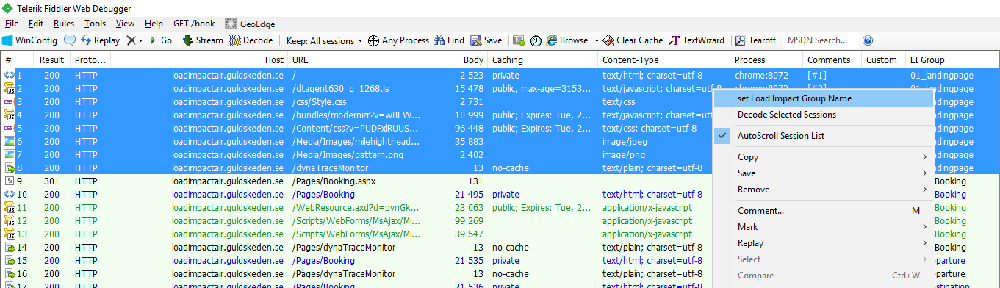

Fiddler to Load Impact script
=============================

**Fiddler**

Load Impact’s world leading performance testing can make great use of Fiddler, the free web debugging proxy for any browser, system or platform from Progress Telerik. Adding the Load Impact export extensions to Fiddler enables you to export Fiddler recordings as either classic Load Impact Lua scripts or the contemporary k6 javascript based scripts. No more manual coding and copy/pasting.

Load Impact covers your back with everything you need for Web, API and application performance testing. And test scripting now has become even simpler using Fiddler.

Do it the Fiddler way
---------------------

Assuming you are familiar with how to use [Fiddler](http://www.telerik.com/fiddler) and Fiddler’s capabilities for recording web traffic including acting as a https proxy for web, apps, devices and assorted you can simply *export* your Fiddler script as a Load Impact script and then just use that script.

The classic Lua version also assumes you have a Load Impact account. [If not, go get one – it’s free](http://loadimpact.com).

The [contemporary k6](https://github.com/loadimpact/k6) version you can run locally as you wish, it too is open sourced!

Ok, installed – now what?
-------------------------

Assuming you are familiar with how to use [Fiddler](http://www.telerik.com/fiddler) and Fiddler’s capabilities for recording web traffic including acting as a https proxy for web, apps, devices and assorted you can simply *export* your Fiddler script as a Load Impact script and then just use that script.

But that’s not all! We have added a little extra that helps in grouping transactions! What does that mean? You might want to name or collect metrics for several requests that comprise one transaction. Such as loading a landing page. That page will load several different resources such as stylesheets, images and code. Those requests together make up one transaction. In classic Load Impact Lua code that is named a *page*. In contemporary k6 javascript code it is named a *group*.

Rather than grouping this manually by refactoring your script code once produced you can label your groups (or pages) in Fiddler before exporting them.

The install adds a column named “LI Group which holds the name of the group of requests you want to bundle in a *page* or *group*.


You name your groups by selecting all the requests that you want in a group in Fiddler, right click on it and in the context menu there is an option “set Load Impact Group Name”.



An entry box will pop up where you enter the name of your group of requests.


Just enter your name and it will set the name in the “LI Group” column for all the requests you consider to be a transaction.

If you save your recording as a Fiddler archive it will retain the naming so you can go back and change, update and continue to work with it later.

Exporting it as a Load Impact classic Lua or contemporary k6 script is as simple as going to the File menu, select export and choose either “k6 javascript” or “LI lua-script” respectively.


Each selection will popup a file save dialog where you get to enter the file name of your script.

Since classic Lua script and contemporary k6 javascript have different capabilities there are some differences to keep track of!

**Request bodies URL-encoded**

In classic Lua script request bodies that are URL-encoded will be strings and look slightly obfuscated since they are url-encoded as is. Something like this

```lua
http.request\_batch({

{"POST",

"http://loadimpactair.guldskeden.se/Pages/Booking", auto\_decompress = true,

data = "\_\_EVENTTARGET=ctl00%24MainContent%24ddlDeparture&\_\_EVENTARGUMENT=&\_\_LASTFOCUS=&\_\_VIEWSTATE=&\_\_VIEWSTATEGENERATOR=A4196A29&\_\_EVENTVALIDATION=&ctl00%24MainContent%24ddlDeparture=1&ctl00%24MainContent%24ddlDestination=-+Select+-", headers = {\["Content-Type"\] = "application/x-www-form-urlencoded"}}

})
```

In contemporary javascript bodies are not encoded as strings in script but rather url-encoded as the request is done. This allows the much more readable objects to be used for bodies. Something like this

```javascript
http.batch(\[

{"method" : "POST",

"url" : "http://loadimpactair.guldskeden.se/Pages/Booking",

"body" : {"\_\_EVENTTARGET":"ctl00$MainContent$ddlDeparture","\_\_EVENTARGUMENT":"","\_\_LASTFOCUS":"","\_\_VIEWSTATE":"","\_\_VIEWSTATEGENERATOR":"A4196A29","\_\_EVENTVALIDATION":"","ctl00$MainContent$ddlDeparture":"1","ctl00$MainContent$ddlDestination":"- Select -"},

> "params" : { headers: { "Content-Type" : "application/x-www-form-urlencoded"} }},

\]);
```

**Binary data**

Classic Lua scripts do not allow files to be used for uploading binary data. The exporter will encode binary uploads as base64 strings and inline them into the script. So scripts can become very large.

Also, it will change to transfer encoding to base64 regardless of what was used at the time of recording.

A sample for a multipart/mime upload can be something like this:

```lua
bin1 = \[\[ a very very long base64 encoding of the binary upload, like hundreds or even thousands of lines of it \]\]

http.request\_batch({

{"POST", "https://my.fake.sample.com/mydata/fenster/settings?SyncToken=LM%3d63692620%3bIDE03F0ABR%3d6361%3d13%3bSI%3d84%3bTD%3dTrue%3bSO%3d0%3bPI%3d49&View=FensterSettingsV2", auto\_decompress = true, data = \[\[

--{84FDFF35-F926-4B9D-9599-558815628CBE}

Content-Type: application/web3s+xml

Content-ID: Settings

&lt;?xml version=\\"1.0\\" encoding=\\"UTF-8\\"?&gt;&lt;Items&gt;&lt;Folder&gt;&lt;RelationshipName&gt;windows-slideshow&lt;/RelationshipName&gt;&lt;RoleDefinitionName&gt;WindowsSettingsFolder&lt;/RoleDefinitionName&gt;&lt;WriteMode&gt;CreateOrUpdate&lt;/WriteMode&gt;&lt;Items&gt;&lt;Document&gt;&lt;RelationshipName&gt;SlideShow&lt;/RelationshipName&gt;&lt;ETag&gt;E03F0AB241D3E649!147.382&lt;/ETag&gt;&lt;WriteMode&gt;Update&lt;/WriteMode&gt;&lt;DateModifiedOnClient&gt;2017-01-05T09:23:42.929Z&lt;/DateModifiedOnClient&gt;&lt;windowssettings.xschema.drx.live.com&gt;&lt;CreationId&gt;0&lt;/CreationId&gt;&lt;/windowssettings.xschema.drx.live.com&gt;&lt;/Document&gt;&lt;/Items&gt;&lt;/Folder&gt;&lt;/Items&gt;

--{84FDFF35-F926-4B9D-9599-558815628CBE}

Content-Type: application/octet-stream

Content-ID: &lt;windows-slideshow/SlideShow:Binary&gt;

Content-Transfer-Encoding: base64

\]\] .. bin1 .. \[\[

--{84FDFF35-F926-4B9D-9599-558815628CBE}--

\]\]

, headers = {\["Content-Type"\] = "multipart/related;boundary=\\"{84FDFF35-F926-4B9D-9599-558815628CBE}\\""}},

})
```

The contemporary k6 javascript allows including external files such as binary files for upload. This makes the script much more efficient and enables k6 scripts to directly use the binary data.

The exporter will create a binary file for each binary upload in the same directory as the exported script file and use those in the script. It will name the file “bin{number}.bin” and simply number binary content in sequence as needed. The binary content files need to go where the k6 script goes of course.

Something like this is the script result

```javascript
bin1 = open("bin1.bin");

http.batch(\[

{"method" : "POST", "url" : "https://my.fake.sample.com/mydata/fenster/settings?SyncToken=LM%3d63619200%3bIAB29!111%3bLR%3d6bEP%3d13%3bSI%3d84%3bTD%3dTrue%3bSO%3d0%3bPI%3d49&View=FensterSettingsV2", "body" : \`

--{84FDFF35-F926-4B9D-9599-558815628CBE}

Content-Type: application/web3s+xml

Content-ID: Settings

&lt;?xml version=\\"1.0\\" encoding=\\"UTF-8\\"?&gt;&lt;Items&gt;&lt;Folder&gt;&lt;RelationshipName&gt;windows-slideshow&lt;/RelationshipName&gt;&lt;RoleDefinitionName&gt;WindowsSettingsFolder&lt;/RoleDefinitionName&gt;&lt;WriteMode&gt;CreateOrUpdate&lt;/WriteMode&gt;&lt;Items&gt;&lt;Document&gt;&lt;RelationshipName&gt;SlideShow&lt;/RelationshipName&gt;&lt;ETag&gt;E03F0AB241D3E649!147.382&lt;/ETag&gt;&lt;WriteMode&gt;Update&lt;/WriteMode&gt;&lt;DateModifiedOnClient&gt;2017-01-05T09:23:42.929Z&lt;/DateModifiedOnClient&gt;&lt;windowssettings.xschema.drx.live.com&gt;&lt;CreationId&gt;0&lt;/CreationId&gt;&lt;/windowssettings.xschema.drx.live.com&gt;&lt;/Document&gt;&lt;/Items&gt;&lt;/Folder&gt;&lt;/Items&gt;

--{84FDFF35-F926-4B9D-9599-558815628CBE}

Content-Type: application/octet-stream

Content-ID: &lt;windows-slideshow/SlideShow:Binary&gt;

Content-Transfer-Encoding: binary

\` + bin1 + \`

--{84FDFF35-F926-4B9D-9599-558815628CBE}--\`

, "params" : { headers: { "Content-Type" : "multipart/related;boundary=\\"{84FDFF35-F926-4B9D-9599-558815628CBE}\\""} }},

\]);
```

Installing
----------

You have two options for installing, either you get the release or you build yourself.

Get the release from github here [Binary release as zip for Windows](https://github.com/loadimpact/FiddlerToLoadImpact/releases)

Download the zip file and extract the contents into your Fiddler ImportExport folder. The default location would be C:\\Program Files (x86)\\Fiddler2\\ImportExport.

You should have the following files there now:

LoadImpact\_Script\_Export.dll

MimeKit.dll

MimeKit.xml

Now you will need to add a new handler for the context menu in Fiddler. You do that in Fiddler.js and the simplest way is to use the FiddlerScript tab in Fiddler.


There you find the handler class (class Handlers) and add this as a new handler for the context meny

```javascript
public static ContextAction("set Load Impact Group Name")
function DoSetLIGroupName(oSessions: Session\[\]) {
if (oSessions == null)
{
MessageBox.Show("Please select session(s) to set LI Group Name for", "No action");
return;
}
var sString: String = FiddlerObject.prompt("LI Group Name", "", "LI Group Name");
for (var x:int = 0; x &lt; oSessions.Length; x++)
{
oSessions\[x\]\["addon.loadimpact.ligroup"\] = sString;
}
FiddlerApplication.UI.RefreshRange(oSessions);
}
```

Adds a new context menu option to set the LI Group Name value to group requests as named groups when exporting to Load Impact script.

It uses the new o-flag value "addon.loadimpact.ligroup" which is used in the exporter to get the Load Impact group name.

But there must be a column to hold the value as well. That is defined inside the Main function.

So lookup the main function static function Main() and insert the following code in it

```javascript
FiddlerObject.UI.lvSessions.AddBoundColumn("LI Group", 512, "addon.loadimpact.ligroup");
```

This adds a named column, "LI Group", of size 512 characters and with the o-flag "addon.loadimpact.ligroup". Both the o-flag value and the column name are used in the exporter so don't change them unless you really know what you're doing and update the exporter code as well.

It hasn’t been tested for other platforms than windows so we recommend building it for the Mac and \*nix versions of Fiddler if you use those. Your mileage may vary!

Building
--------

Just get the Visual Studio project from github here [VS project](https://github.com/loadimpact/FiddlerToLoadImpact/releases). You will do just fine with the community version of Visual Studio.

You must get a dependency in place to build it, it’s the <http://www.mimekit.net/>. It’s slightly overkill but saves a lot of time in deconstructing multipart bodies.

Of course, you need Fiddler as well but maybe that’s a given.

Happy load testing!
